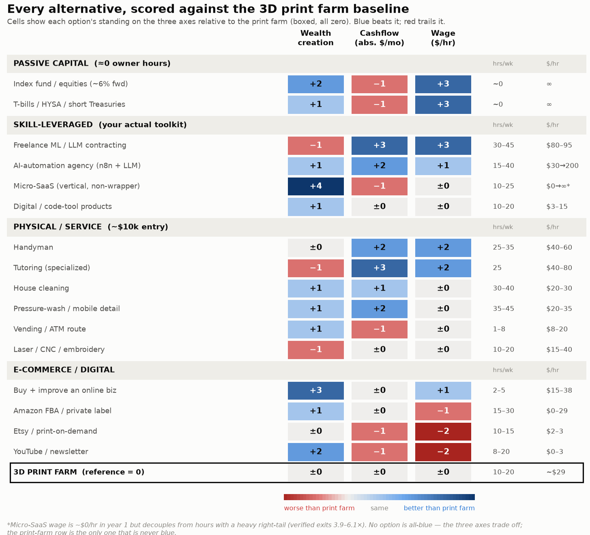

# $10,000, Three Ways to Win — The Print Farm vs. Its Alternatives

**Companion analysis to the Peninsula Additive business plan · July 2026**

> **The question:** given the same ~$10,000, which deployments *outperform* a 3D print farm on (1) wealth creation, (2) cashflow, and (3) wage — the time/labor cost of ownership? Every comparator below carries verified July-2026 numbers; sources and confidence flags are in the underlying research and the main plan's appendix. Founder frame: a Bay Area data scientist with a ~$70–120/hr opportunity cost, strong software/ML/automation skills, and an MS in progress (so options that keep a W-2/contract alive matter).

---

## 1. The reframe that decides everything

At $10k, **the capital is a rounding error and your time is the real investment.** A single printer is ~$600; the binding input to any of these businesses is founder-hours valued at $70–120 each. That single fact reorganizes the whole comparison into a **three-way trade-off**, because no option maximizes all three axes at once:

- **Wage / time-cost** is maximized by deploying *zero* hours → passive capital.
- **Cashflow** is maximized by selling your *scarcest, highest-priced* hours → freelance ML/LLM work.
- **Wealth creation** is maximized by building an asset that *detaches* from your hours and carries a sale multiple → micro-SaaS.

These three winners are different options. The print farm is none of them — and, as the scorecard shows, it is beaten on *every* axis by something.

---

## 2. The master scorecard

Each option scored **relative to the 3D print farm** (the boxed baseline = 0). Blue = better than the print farm on that axis; red = worse.

| Option | Wealth | Cashflow | Wage $/hr | Owner hrs/wk | Implied $/hr |
|---|:--:|:--:|:--:|:--:|:--:|
| **PASSIVE CAPITAL** | | | | | |
| Index fund / equities (~6% fwd) | +2 | −1 | +3 | ~0 | ∞ |
| T-bills / HYSA / short Treasuries | +1 | −1 | +3 | ~0 | ∞ |
| **SKILL-LEVERAGED** | | | | | |
| Freelance ML / LLM contracting | −1 | **+3** | **+3** | 30–45 | $80–95 |
| AI-automation agency (n8n + LLM) | +1 | +2 | +1 | 15–40 | $30→200 |
| Micro-SaaS (vertical, non-wrapper) | **+4** | −1 | ±0* | 10–25 | $0→∞* |
| Digital / code-tool products | +1 | ±0 | ±0 | 10–20 | $3–15 |
| **PHYSICAL / SERVICE** | | | | | |
| Handyman | ±0 | +2 | +2 | 25–35 | $40–60 |
| Tutoring (specialized) | −1 | +3 | +2 | 25 | $40–80 |
| House cleaning | +1 | +1 | ±0 | 30–40 | $20–30 |
| Pressure-wash / mobile detail | +1 | +2 | ±0 | 35–45 | $20–35 |
| Vending / ATM route | +1 | −1 | ±0 | 1–8 | $8–20 |
| Laser / CNC / embroidery | −1 | ±0 | ±0 | 10–20 | $15–40 |
| **E-COMMERCE / DIGITAL** | | | | | |
| Buy + improve an online biz | +3 | ±0 | +1 | 2–5 | $15–38 |
| Amazon FBA / private label | +1 | ±0 | −1 | 15–30 | $0–29 |
| Etsy / print-on-demand | ±0 | −1 | −2 | 10–15 | $2–3 |
| YouTube / newsletter | +2 | −1 | −2 | 8–20 | $0–3 |
| **3D PRINT FARM (baseline)** | ±0 | ±0 | ±0 | 10–20 | ~$29 |

*Micro-SaaS pays ~$0/hr in year 1 but decouples income from hours with a heavy right tail (verified exits 3.9–6.1× profit).

**The one-line reading of the whole table:** the print-farm row is the only row that is *never blue*. Everything else beats it somewhere.

---

## 3. Who wins each axis (and by how much)

### Wealth creation → **Micro-SaaS** (then: buy-and-improve, audience assets, index fund)
The print farm's "asset" is depreciating hardware that resells for pennies plus a fragile marketplace listing — verified resale ≈ $0 and **no transferable multiple**. Its direct physical twins (laser, CNC, embroidery) share the identical dead-end. What actually creates *sellable* wealth on $10k:
- **Micro-SaaS** is the only option that both decouples from your hours *and* trades on a real multiple — **3.9× profit median (Acquire.com), up to 6.1× top-quartile (Flippa)**. A vertical SaaS at $5k MRR (~$40k profit) ≈ a **$150–300k** sale. That is the wealth event a print farm structurally cannot produce.
- **Buying and improving** an existing online business (+3) converts $10k into ~$250–500/mo of *day-one* cashflow at ~1.7–2.6× and lets a technical founder automate and re-sell at a higher multiple.
- Even the **index fund** (+2) quietly out-creates the farm: ~$13.4k in 5 years at a ~6% forward return, with *zero* hours and full liquidity.

Caveat: micro-SaaS is bimodal — ~54% of indie products make $0 and ~70% never clear $1k MRR. It is the highest *ceiling*, not the highest *expected value*.

### Cashflow → **Freelance ML / LLM contracting** (then: agency, tutoring, handyman, services)
The farm's realistic year-1 cash is ~$500–2,500/mo (and *negative* economic profit once your wage is charged). Beaten decisively by:
- **Freelance ML/LLM** (+3): $6–12k/mo, billing $130–180/hr, at ~$80–95/hr effective after non-billable time. It simply converts your salary to hourly — highest *certain* cash, but zero asset and fully labor-bound.
- **AI-automation agency** (+2): $3–10k/mo with recurring retainers that partially decouple from your hours — a better *structure* than pure freelance.
- Even low-tech **tutoring** ($6–8k/mo) and **handyman** ($4–6k/mo) out-earn the farm on cash, because equipment businesses hide the owner's real labor inside flattering "per-machine-hour" math.

Note the trade-off: passive capital *loses* on absolute cashflow (an index fund throws off only ~$107/yr in dividends; T-bills ~$400/yr on $10k) — high cash requires either selling hours or owning far more capital.

### Wage / time-cost of ownership → **Passive capital** (∞ $/hr), then **Freelance** and **Buy-a-biz**
This is the axis the print farm most clearly loses. Its implied wage is ~$29/hr against your ~$70–120/hr alternative — you would earn more per hour doing almost anything you're already good at.
- **Passive capital** consumes ~0 hours → implied wage is effectively **infinite**. This is the true hurdle: an active business must beat ~4% risk-free / ~6% equity *and* pay you fully for every hour *and* compensate concentrated, illiquid risk. Most $10k businesses fail this test.
- Among *active* options, **freelance** ($80–95/hr) and **handyman/tutoring** ($40–80/hr) clear your bar; the farm does not.
- **Buying a business** is the efficiency standout: ~$15–38/hr but at only **2–5 hrs/week**, i.e., a 30–60% cash-on-cash yield for minimal time.

---

## 4. The verdict: the print farm is Pareto-dominated

A rational, purely financial ranking of the print farm against these alternatives is unambiguous: **for whichever of the three goals you care about, a better instrument exists, and it is usually one that fits your skills better.**

- Want **wealth**? Build one focused vertical micro-SaaS, or buy-and-improve a cashflowing asset. The farm builds no equity.
- Want **cashflow**? Contract your ML/LLM skills, or run an automation agency. The farm pays below your wage.
- Want your **time respected**? Park the capital in a T-bill ladder or index fund (0 hours), or buy a semi-passive business (2–5 hrs). The farm demands 10–20 hrs at ~$29/hr.

The print farm's closest analogs — laser, CNC, embroidery, and Amazon FBA — are instructive: they share its *exact* failure modes (marketplace saturation, capacity-before-demand, depreciating equipment, no sellable multiple). FBA is the purest mirror: pre-buying inventory that may not sell ≈ pre-buying printers before you have print jobs.

## 5. The profile-fit recommendation: a barbell, not a farm

No single option wins all three axes, so the highest-expected-value move for *this* founder combines them — and each leg is compatible with the MS and a day job:

1. **Wage/time leg — park the $10k.** A T-bill ladder or index fund captures the ~4–6% passive hurdle at zero time cost. This is the honest floor; don't tie up capital in a business that can't beat it.
2. **Cashflow leg — sell the scarce hours.** Moonlight ML/LLM contracting or a small automation agency ($100–200/hr matured) for *certain* cash that also funds runway. Uses your exact toolkit; keeps the W-2 optional.
3. **Wealth leg — one focused swing.** Spend discretionary hours on a *single* vertical, non-wrapper micro-SaaS (your ML + full-stack + n8n skills dodge the 90%-AI-wrapper-failure trap). This is the only lever with a sellable multiple — the wealth event.

This barbell beats the print farm on **all three axes simultaneously**, at lower capital risk, using skills you already have.

## 6. When the print farm still makes sense (the honest exception)

The comparison above is purely financial. The print farm wins on axes this scorecard doesn't price: **tangibility, hands-on additive-manufacturing learning, a local physical presence, portfolio diversification away from a screen-based career, and simple enjoyment.** If the actual goal is *"I want to learn AM and build physical things,"* that is a legitimate reason — but it should be named as a *consumption/learning* choice with a known ~$4–6k worst-case cost, not defended as the best financial use of $10k. It is not. If the goal is wealth, cashflow, or respecting your time, the instruments above dominate it.

---

*Scores are relative rankings anchored to verified 2026 figures (passive-capital rates, freelance/SaaS/agency benchmarks, physical micro-business operator data, e-commerce/acquisition multiples). Marketplace multiples (Acquire.com/Flippa) and some income ranges reached the research via search-indexed content of primary reports; treat single-operator revenue figures as survivor-biased texture, never expected value. See the companion `3d-printing-business-plan.md` and `print-farm-economics-report.pdf` for the full print-farm model and method.*
