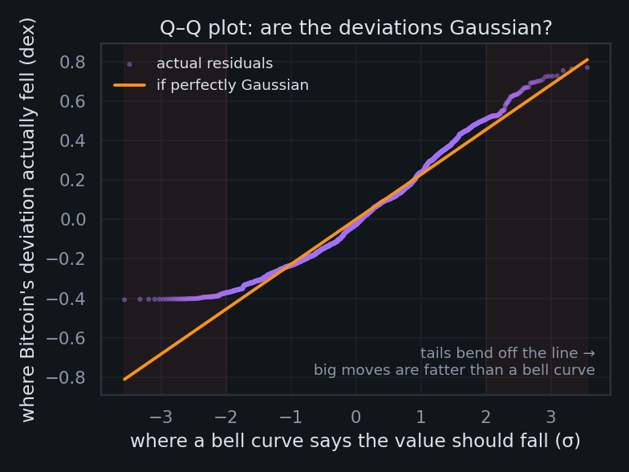
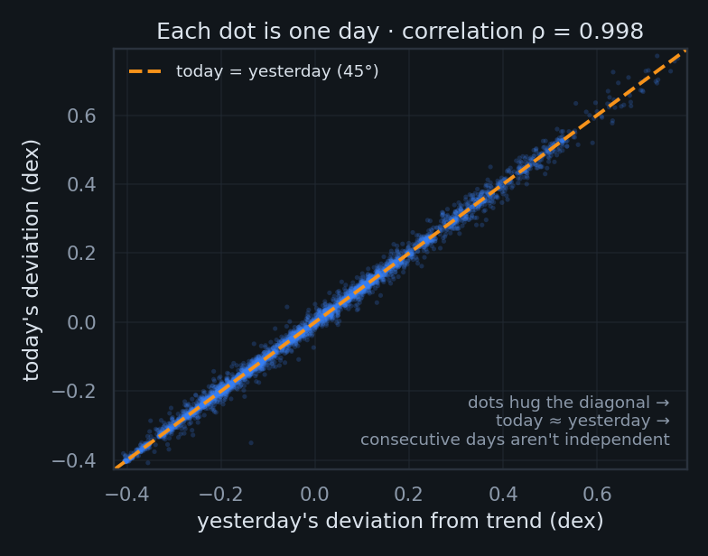

# Audit report — "Does Bitcoin Follow a Power Law?"

**Page audited:** https://scottn66.github.io/bitcoin-power-law/index.html
**Source state:** `origin/main` @ `d199647` (deployed); page `data.js` generated 2026-06-16 07:20 UTC
**Audit date:** 2026-06-17
**Method:** 9 independent dimension-finders (correctness, statistics, accessibility, performance, SEO, security, responsive, editorial, HTML standards), each followed by an adversarial verifier that re-opened the source files and re-derived every number before a finding was admitted.

---

## Executive summary

The page is strong, well-engineered work. The JavaScript is clean — every `PL.*` read resolves against `data.js`, every `getElementById` has a matching element, all external `target="_blank"` links carry `rel="noopener"`, and all five figures have alt text. The econometrics is mostly sophisticated and honestly hedged. Findings cluster in five areas: **one real statistics bug**, **accessibility**, **load performance**, **social/SEO metadata**, and a **house-style conflict**.

The audit raised 69 candidate findings; adversarial verification confirmed 61 and rejected 8. After dropping one corrected false-positive and merging four cross-lens duplicates, **56 unique findings** remain, summarised below.

| Severity | Count |
|---|---|
| 🔴 Critical | 1 |
| 🟠 High | 3 |
| 🟡 Medium | 11 |
| ⚪ Low | 31 |
| ▪️ Nit | 10 |

| Dimension | Findings |
|---|---|
| seo | 9 |
| a11y | 8 |
| stats | 7 |
| perf | 7 |
| editorial | 6 |
| responsive | 6 |
| correctness | 5 |
| security | 5 |
| standards | 3 |

### The one to fix first
**The KPSS stationarity test is interpreted backwards on-screen** (`index.html:439`). KPSS's null is *stationarity*; with `kpss_p = 0.077 > 0.05` the test *fails to reject* stationarity (leans **stable**), but the page renders "borderline, leans unstable" — the opposite. The section's overall thesis survives (it rests on ADF, Durbin–Watson, and Ljung–Box), so the honest fix actually strengthens it: ADF can't reject a unit root *while* KPSS can't reject stationarity is a textbook inconclusive / low-power result.

---

## Suggested order of attack

**Today** — the KPSS fix (a visible factual error) and the contrast-token fix (one line, fixes dozens of spots).

**This week** — switch to the `plotly-basic` bundle and stop it blocking the parser; add the Open Graph block; reconcile the 17% / 21% percentile labels; pin MathJax to an exact version.

**Polish pass** — em-dash sweep; metadata block (canonical, favicon, theme-color, JSON-LD); table scroll wrappers; lazy-loading; the remaining low/nit items.

---

## 🔴 Critical (1)

### 1. KPSS test reading is statistically backwards — p=0.077 is reported as "leans unstable" when it means the opposite

- **Dimension:** stats · **Confidence:** high
- **Location:** index.html — stationarity table builder, line 439 (#statab KPSS row)
- **Issue:** KPSS has a NULL of stationarity (trend/level stationary). The data has kpss_p=0.0767, which is > 0.05, so the test FAILS to reject stationarity — i.e. it leans toward stable/stationary. The JS encodes the rule `c.kpss_p<0.05?'rejects stability':'borderline, leans unstable'`, so with p=0.077 it renders the reading "borderline, leans unstable." That is the wrong direction: failing to reject the stationary null leans STABLE, not unstable. This is shown to readers in the table and is a factually incorrect interpretation of a named statistical test. (It also undercuts the section's whole "non-stationary" thesis, but the fix is to state the result correctly: KPSS here is borderline and actually does not reject stationarity, in mild tension with ADF — which is itself the honest finding.)
- **Evidence:** data.js cointegration.kpss_p=0.07668683489628747; index.html line 439: "(c.kpss_p<0.05?'rejects stability':'borderline, leans unstable')"
- **Fix:** Flip the non-rejection branch to reflect KPSS's null, e.g. `c.kpss_p<0.05?'rejects stationarity (leans non-stationary)':'fails to reject stationarity (borderline, leans stable)'`. Then reconcile the surrounding prose: ADF can't reject a unit root while KPSS can't reject stationarity is a genuine "inconclusive/low-power" outcome, which is worth stating honestly rather than mislabeling KPSS as evidence of instability.
- **Verified / corrected:** index.html line 439: KPSS with kpss_p=0.0767 (>0.05) fails to reject its stationarity null, which leans STABLE/stationary; the code labels it "borderline, leans unstable," which is the wrong direction. The result is genuinely borderline and, combined with ADF's inability to reject a unit root, indicates an inconclusive (low-power) outcome rather than evidence of instability.

## 🟠 High (3)

### 1. Body copy in --dim (#6b7787) fails WCAG AA contrast (4.5:1) at small sizes

- **Dimension:** a11y · **Confidence:** high
- **Location:** index.html CSS: figcaption (line 71, 12.5px), th (line 80, 11px), .chip .k (line 55, 11px), .byline (line 50, 13.5px), footer (line 90, 13px), inline notes lines 166 & 258 (12.5px), footer note line 311; color token --dim:#6b7787 defined line 19
- **Issue:** --dim #6b7787 yields a contrast ratio of only 4.28:1 on --bg #0a0d12, 3.92:1 on --card #121821, and 4.06:1 on --card2 #0f141c (computed via WCAG relative-luminance formula). WCAG 2.1 AA requires 4.5:1 for normal-size text. Every use of --dim is normal-weight text well below the 18.66px (or 14px-bold) large-text threshold: figcaptions (12.5px) under all 5 figures and the Plotly charts, table header cells th (11px) in every table, the chip key labels (.chip .k, 11px), the hero byline (13.5px), the whole footer (13px), and the two explanatory notes plus the credits line. This is the single most pervasive a11y defect on the page: substantial explanatory content (figure captions, table headers, method/credits) is below AA. On --card backgrounds (figcaptions inside .card, th inside tables, footer over the page) it drops to ~3.9-4.1:1, failing even more clearly.
- **Evidence:** --dim:#6b7787 ... ratios computed: #6b7787 on #0a0d12 = 4.28, on #121821 = 3.92, on #0f141c = 4.06 (all < 4.5 AA threshold)
- **Fix:** Lighten --dim to at least ~#7e8b9c (≈4.6:1 on --card) or preferably ~#8a97a8 to clear 4.5:1 on the darkest --card surfaces with margin. Re-verify each surface, since figcaption/th render on --card not --bg. Alternatively bump the smallest text (11px th and chip keys) up in size and weight, but raising the token color is the clean fix.
- **Verified / corrected:** Accurate as stated. Minor precision note: the byline (L114) and footer render over --bg/--bg2 (~4.10–4.28:1), while figcaptions, th, and the two inline notes render over --card/--card2 (~3.9–4.06:1); all fail 4.5:1 AA either way.

### 2. Plotly full bundle (~3.5MB min) loaded render-blocking in <head> with no async/defer

- **Dimension:** perf · **Confidence:** high
- **Location:** index.html line 10: 
- **Issue:** The full Plotly build is referenced with a plain synchronous 
- **Fix:** Switch to the plotly-basic distribution (https://cdn.plot.ly/plotly-basic-2.35.2.min.js) which covers scatter/line/shapes/annotations, and add the defer attribute (or move the tag to the end of <body>) so it no longer blocks the parser. The inline init script already runs at end of <body>, so a deferred Plotly will still be available by the time newPlot is called; if moving to body, ensure Plotly loads before the inline init script.
- **Verified / corrected:** The full Plotly bundle is actually ~4.3MB uncompressed (4,558,696 bytes), not ~3.5MB; plotly-basic-2.35.2 is ~1.0MB (1,071,091 bytes), a ~3.5MB saving. Note a correctness caveat in the fix: the sole Plotly consumer is a plain (non-deferred) inline script at the end of <body> (line 314), which executes during parsing — adding `defer` to the line 10 tag alone would make Plotly load AFTER that inline script runs Plotly.newPlot, throwing a ReferenceError. The safe fix is to move the (basic) Plotly tag to just before the inline init script at end of <body> (still render-unblocking), or wrap the init in a DOMContentLoaded/load handler. The finding flags this caveat but its primary 'add defer' suggestion would break rendering if applied naively.

### 3. No Open Graph tags: shared link previews as a bare URL with no image, title, or description

- **Dimension:** seo · **Confidence:** high
- **Location:** /Users/scottnelson/Library/Mobile Documents/com~apple~CloudDocs/Desktop/website-related/scottn66.github.io/.audit-bitcoin/bitcoin-power-law/index.html (head, lines 3-15)
- **Issue:** The <head> contains only <title> and <meta name="description">. There are zero Open Graph tags (og:title, og:description, og:image, og:url, og:type). When this 'research note' is pasted into Slack, iMessage, LinkedIn, Discord, Reddit, or Facebook, the unfurl falls back to a bare link with no card, no preview image, and often a truncated/raw title. This directly undercuts the page's purpose: it is explicitly framed as a shareable note ('every chart is interactive; every test is reproducible'). Sibling pages already follow the house OG pattern, e.g. Q.html lines 10-14 set og:title/og:description/og:image/og:url plus twitter:card='summary_large_image', so this page is the exception, not the rule.
- **Evidence:** index.html lines 6-7 are the only metadata: '<title>Does Bitcoin Follow a Power Law? — An Econometric Autopsy</title>' and '<meta name="description" content="An interactive, multi-lens econometric scrutiny..."/>'. grep for 'og:title|og:image|twitter:card' across the page returns nothing. Compare Q.html line 12: '<meta property="og:image" content="https://scottn66.github.io/robot-arm-sim/img/end_card_resolution.png">'.
- **Fix:** Add the standard OG block to <head>: og:type='article', og:url='https://scottn66.github.io/bitcoin-power-law/', og:title (em-dash-free, see separate finding), og:description (reuse the meta description), and og:image pointing to an absolute https URL of a representative 1200x630 card. The 5 existing seaborn PNGs in assets/ (e.g. fig_aic.png) are not ideal social cards (wrong aspect ratio, tiny, no title), so generate a dedicated og-image; until then, an absolute URL to assets/fig_aic.png is better than nothing.
- **Verified / corrected:** The meta description is on line 7 (not lines 6-7); otherwise the finding is accurate. index.html has zero OG/Twitter tags while Q.html and the repo root index.html both follow the OG house pattern.

## 🟡 Medium (11)

### 1. Interactive Plotly chart containers have no text alternative, role, or aria-label for screen readers

- **Dimension:** a11y · **Confidence:** high
- **Location:** index.html: #hero (line 129), #osc (line 219), #lppls (line 242), #roll (line 254); Plotly.newPlot calls in the inline script (lines 415, 483, 536, 565)
- **Issue:** The four interactive charts are built into empty 
 elements via Plotly.newPlot. Plotly renders the chart as inline SVG with no accessible name, no role="img", and no descriptive text alternative. A screen-reader user reaching #hero, #osc, #lppls, or #roll hears nothing meaningful — the entire visual argument of four of the eight lenses is inaccessible. The data underlying each chart (fit line, price series, sigma bands, z-score, LPPLS fit, rolling exponent) exists in window.PL but is never exposed as text. The adjacent <figcaption> describes how to interact ("hover, drag to zoom") but is not programmatically associated with the chart div and does not convey the chart's content/conclusion.
- **Evidence:** 

 ... Plotly.newPlot('hero',tr,lay,CFG); — no aria/role attributes anywhere on the four .plot divs
- **Fix:** Wrap each chart in <figure role="figure" aria-label="..."> or add role="img" plus aria-label to the chart div summarizing what it shows and the takeaway (e.g. aria-label="Bitcoin log-log price vs power-law fit; price tracks a straight trend line from $0.05 in 2010 to six figures in 2026 within a plus/minus 2 sigma corridor"). Associate the existing figcaption via aria-describedby. Provide a visually-hidden data table or text summary as a fallback for the numeric content.

### 2. No skip-to-content link; horizontally scrolling nav must be traversed before reaching main

- **Dimension:** a11y · **Confidence:** high
- **Location:** index.html: <nav> lines 97-108, <main> line 118 (no skip link before nav)
- **Issue:** There is no skip-link as the first focusable element. The sticky <nav> contains a brand span plus 9 in-page anchor links that a keyboard or screen-reader user must tab through on every visit before reaching the main content. WCAG 2.4.1 (Bypass Blocks) expects a mechanism to skip repeated navigation. The nav also uses overflow-x:auto with hidden scrollbars (line 38-39), so on narrow viewports later nav links are off-screen and only reachable by tab-then-auto-scroll, compounding the problem.
- **Evidence:** <body>\n\n<nav>
  — first element after body is the nav, no skip link; nav .wrap{...overflow-x:auto;scrollbar-width:none}
- **Fix:** Add <a href="#claim" class="skip-link"> (or to a #main target) as the first child of <body>, visually hidden until focused (e.g. position:absolute;left:-9999px; then :focus reveals it). Add id="main" to <main> as the target.

### 3. No visible keyboard focus indicator (:focus-visible) on nav links, in-page links, or chart controls

- **Dimension:** a11y · **Confidence:** high
- **Location:** index.html CSS: a{} rules lines 31-32 and nav a rules lines 42-43; no :focus or :focus-visible rule anywhere in the <style> block (lines 16-93)
- **Issue:** The stylesheet defines a:hover (text-decoration:underline) and nav a:hover (background + color change) but never defines :focus or :focus-visible. On a dark theme the browser default focus ring is often low-contrast or, combined with custom backgrounds, can be visually lost. Keyboard users tabbing through the 9 nav links, the inline reference links (Wikipedia, Lens cross-links), and the Plotly mode-bar/button controls have no reliable visible indication of focus position, failing WCAG 2.4.7 (Focus Visible).
- **Evidence:** a:hover{text-decoration:underline} / nav a:hover{background:var(--card);color:var(--ink)...} — hover states exist but there is no :focus or :focus-visible selector in the CSS
- **Fix:** Add an explicit high-contrast focus style, e.g. a:focus-visible, nav a:focus-visible, button:focus-visible { outline:2px solid var(--orange); outline-offset:2px; border-radius:4px; }. Do not remove the default outline without replacing it.
- **Verified / corrected:** No custom :focus-visible style exists; the page relies on the browser default focus ring (outline is never explicitly removed). On the dark theme and custom-styled nav pills this default ring can be low-contrast or visually lost, degrading (not eliminating) keyboard focus visibility across the 16 focusable anchors. There are no <button> elements in the file; Plotly mode-bar controls are runtime-generated and outside this static file.

### 4. Two different "corridor percentile" values shown to the reader for the same concept (17% vs 21%)

- **Dimension:** correctness · **Confidence:** high
- **Location:** index.html line 338 (chips, reads cur.corridor_percentile) and line 506 (mrcard, reads m.current_percentile); plus inline prose at line 343/data.js mean_reversion.interpretation
- **Issue:** The header chip labeled "Corridor" renders Math.round(cur.corridor_percentile) = Math.round(17.424…) = 17%, sourced from PL.current.corridor_percentile = 17.42. The Lens-4 "Where Bitcoin stands today" card renders Math.round(m.current_percentile) = Math.round(20.734…) = 21%, sourced from PL.mean_reversion.current_percentile = 20.73. Both describe the same thing — where today's price sits in the historical deviation corridor — yet the page shows 17% in the hero chip and 21% in the card (and the data.js interpretation string also says "21th percentile"). A reader comparing the two cannot reconcile them; it reads as an internal contradiction.
- **Evidence:** current.corridor_percentile = 17.424242424242426 (chip shows 17%); mean_reversion.current_percentile = 20.734045466995344 (mrcard shows 21%)
- **Fix:** Pick one canonical percentile and bind both the chip and the card to it (e.g. make the chip read PL.mean_reversion.current_percentile too, or recompute current.corridor_percentile from the same residual/sigma used for current_percentile). At minimum reconcile the two values in data.js so they round to the same integer.
- **Verified / corrected:** The page shows 17% (hero "Corridor" chip, from the full-sample power-law fit, σ=0.276 dex) and 21% (Lens-4 "Corridor percentile" card and interpretation string, from the stationary OU residual, σ=0.230 dex) under near-identical labels with no disambiguation. Both are internally correct for their own model; the defect is the shared/ambiguous labeling, not an arithmetic inconsistency, so the fix is to relabel/disambiguate (or pick one canonical percentile) rather than to force the two data.js values to round equal.

### 5. Disclaimer is single, footer-only, and far from the page's buy-signal language

- **Dimension:** editorial · **Confidence:** high
- **Location:** /Users/scottnelson/Library/Mobile Documents/com~apple~CloudDocs/Desktop/website-related/scottn66.github.io/.audit-bitcoin/bitcoin-power-law/index.html line 311 (footer disclaimer) vs lines 220 and 227 (valuation language)
- **Issue:** The page makes actionable-sounding valuation statements well above the fold of the disclaimer: line 220 'below the midline = historically cheap, above = expensive'; line 227 (Lens 4 verdict) 'Today Bitcoin sits below fair value, historically a favorable zone.' The chips even surface 'Price ÷ model' and 'Corridor' percentile prominently. The only 'Educational analysis — not investment advice' disclaimer sits once at line 311 in the footer, after eight long sections. A reader who stops at the Lens 4 verdict (a natural exit point that reads like a buy signal) never sees it.
- **Evidence:** line 227: 'Today Bitcoin sits below fair value, historically a favorable zone.'  line 220: 'below the midline = historically cheap'  line 311: 'Educational analysis — not investment advice.'
- **Fix:** Either soften the valuation verdicts (e.g. 'historically a below-average corridor position' rather than 'a favorable zone' / 'cheap'), or add a short inline disclaimer near the first valuation claim (Lens 4 verdict, line 227) so the 'not investment advice' caveat travels with the price-context language instead of living only in the footer.
- **Verified / corrected:** The page contains exactly one disclaimer ("Educational analysis — not investment advice.") at index.html line 311 in the footer, after all 8 lenses. Actionable valuation language appears far earlier and above the fold: the hero chips at line 115 (built lines 332-342) surface "Price ÷ model" (0.57×) and "Corridor" (17%), the Lens 4 oscillator figcaption at line 220 calls below-midline "historically cheap," and the Lens 4 verdict at line 227 states Bitcoin "sits below fair value, historically a favorable zone." These valuation statements are data-accurate per data.js (ratio_to_model 0.574, corridor_percentile 17.4) and are contextually hedged elsewhere, so the issue is disclaimer placement/proximity, not a false claim.

### 6. data.js (108KB) loaded synchronously in <head>, blocking the parser before any content paints

- **Dimension:** perf · **Confidence:** high
- **Location:** index.html line 15:   (file assets/data.js is 108,572 bytes)
- **Issue:** assets/data.js (verified 108,572 bytes / ~106KB) is a plain synchronous script in <head>. It is parser-blocking: the browser stops, fetches and executes it before continuing. None of the page's chrome (nav, hero text, section copy) needs window.PL to render — only the inline init script at the bottom of <body> consumes it. Pairing a 106KB blocking data file with the already-blocking Plotly tag stacks two serial round trips ahead of first paint.
- **Evidence:** 
- **Fix:** Add defer to the data.js tag () or move it to just before the inline init 
- **Issue:** The MathJax script is pinned only to the major tag `mathjax@3`. jsDelivr resolves `@3` to whatever the latest 3.x release is at request time (currently 3.2.2), so the exact bytes served can change under you without any change to this repo. This breaks reproducibility and, more importantly, it is impossible to add Subresource Integrity to a moving tag (an `integrity` hash would break the moment npm publishes a new 3.x). The page therefore executes third-party JavaScript with full access to the DOM and to `window.PL` with zero integrity guarantee and a content surface that can silently change. Contrast with Plotly on line 10, which is correctly pinned to an exact version (2.35.2). Note SRI genuinely cannot be applied while the tag stays moving — the fix is to pin first, then add SRI.
- **Evidence:** src="https://cdn.jsdelivr.net/npm/mathjax@3/es5/tex-svg.js"
- **Fix:** Pin MathJax to an exact patch version and add SRI, e.g. ``. Generate the hash with `curl -s https://cdn.jsdelivr.net/npm/mathjax@3.2.2/es5/tex-svg.js | openssl dgst -sha384 -binary | openssl base64 -A`. (jsDelivr also exposes per-file SRI hashes in its UI.) If you prefer maximum control, self-host the tex-svg bundle under assets/ and drop the CDN entirely.
- **Verified / corrected:** MathJax is loaded from a moving major tag (mathjax@3, line 14), which is non-reproducible and SRI-incompatible. This is real but is one symptom of a page-wide absence of SRI (Plotly on line 10 and Google Fonts on line 9 also lack integrity hashes). On a static no-backend page with only public chart data, the risk is standard CDN supply-chain drift, warranting medium rather than high severity.

## ⚪ Low (31)

### 1. scroll-behavior:smooth not gated by prefers-reduced-motion

- **Dimension:** a11y · **Confidence:** high
- **Location:** index.html CSS: html{scroll-behavior:smooth} line 24
- **Issue:** Global smooth scrolling is applied unconditionally. Users who set prefers-reduced-motion (vestibular sensitivity) still get animated scroll-jumps when activating the in-page nav anchors (#claim, #fit, etc.). WCAG 2.3.3 (AAA) and general motion best practice call for honoring the reduced-motion preference.
- **Evidence:** html{scroll-behavior:smooth} — applied at the root with no prefers-reduced-motion guard
- **Fix:** Wrap it in a query: @media (prefers-reduced-motion: no-preference){ html{scroll-behavior:smooth} } so reduced-motion users get instant jumps.
- **Verified / corrected:** html{scroll-behavior:smooth} at index.html line 24 is the only motion-related CSS in the file and is not gated by prefers-reduced-motion; it animates in-page anchor navigation for vestibular-sensitive users (WCAG 2.3.3, AAA).

### 2. Tables built via innerHTML lack <caption> and th scope attributes

- **Dimension:** a11y · **Confidence:** high
- **Location:** index.html: empty <table id=...> at lines 151 (#fittab), 165 (#statab), 240 (#lpplstab), 257 (#chowtab), 194/195 (#mtab_full/#mtab_recent), plus static table lines 182-190; thead/th strings generated in script at lines 430, 445, 458, 539, 568
- **Issue:** All data tables (fit inference, stationarity tests, model tournament, LPPLS cycles, Chow tests) are populated by innerHTML that emits <th> cells without scope="col" and with no <caption>. The static model-claims table (lines 182-190) also omits scope and caption. Without scope, screen readers cannot reliably associate header cells with data cells in multi-column tables (e.g. the 7-column LPPLS table, the 4-column stationarity table where each row's 'Reading' depends on its 'Test' header). Without a caption the table has no accessible name describing its purpose. WCAG 1.3.1 (Info and Relationships).
- **Evidence:** '<thead><tr><th>Test</th><th>What it asks</th><th class="num">p / stat</th><th>Reading</th></tr></thead>...' — th elements emitted with no scope attribute; no <caption> element on any table
- **Fix:** Emit <th scope="col"> in every generated thead (and scope="row" on the first cell of each row where it is a row header, e.g. the Test name / Model name / Cycle label). Add a <caption> (can be visually hidden) to each table summarizing it, e.g. 'Stationarity test results'.
- **Verified / corrected:** All data tables with column headers omit `scope` and `<caption>` (confirmed: zero occurrences of either in the file). The accessibility impact is real but minor for these simple single-header-row tables — modern screen readers infer column association without `scope="col"` — so this is low/polish, not medium. The most material gap is `scope="row"` on the first cell of each row in the wider multi-column tables (#lpplstab 7-col, #statab/#chowtab/#mtab 4-col), where row+column association genuinely aids comprehension.

### 3. Section topic labels ("Lens N") are styled 
, not headings, breaking the document outline

- **Dimension:** a11y · **Confidence:** high
- **Location:** index.html: .lenstag divs at lines 121,136,157,175,203,231,249,264,279 (e.g. 'Lens 1 — Fit & honest inference'); .lenstag CSS lines 59-60
- **Issue:** Each section is introduced by a non-heading 
 carrying the lens number and title ("Lens 1 — Fit & honest inference"), followed by an <h2>. The lens label is the primary wayfinding label for the section but is invisible to a screen reader's heading navigation, and the numbered structure (0-7 plus the scorecard) is conveyed only visually via the .lensnum badge. The heading order h1 -> h2 -> h3 is otherwise correct, but the meaningful section-numbering metadata is not exposed semantically.
- **Evidence:** 
1 Lens 1 — Fit & inference
 followed by <h2>The exponent is real...</h2> — the lens identifier is in a div, not a heading
- **Fix:** Either fold the lens label into the h2 (e.g. <h2>Lens 1 - Fit & honest inference</h2> with the descriptive line as a sub-element), or mark the numeric badge as decorative (aria-hidden) while ensuring the section's accessible name still conveys which lens it is. At minimum keep the visual order so the badge is announced near the heading.
- **Verified / corrected:** The lens/section labels are presented in non-heading `
` elements (lines 121, 136, 157, 175, 203, 231, 249, 264, 279), so the "Lens N" number and short lens title are conveyed only visually and are absent from the accessible heading text. The document outline itself is NOT broken: each section still has a well-formed, descriptive `<h2>` (h1->h2->h3 hierarchy is correct and navigable). This is a minor a11y enhancement gap (decorative wayfinding metadata not exposed semantically), not a broken outline. The finding also misquotes the label: the file reads "Lens 1 — Fit & honest inference", not "Lens 1 — Fit & inference".

### 4. Hero x-axis title stays "log scale (days since genesis)" after toggling to calendar-time/linear view

- **Dimension:** correctness · **Confidence:** high
- **Location:** index.html lines 401-402 (xaxis.title) and 409-413 (updatemenus buttons)
- **Issue:** The hero chart's x-axis title is hard-coded to 'year — log scale (days since genesis)'. The second button ("calendar time · log price") relayouts only 'xaxis.type':'linear' and does not update the axis title, so after the user switches to the calendar-time/linear view the axis still claims "log scale". The figcaption and prose specifically tell the reader this button switches between log and linear, so the stale "log scale" label directly contradicts the active view.
- **Evidence:** xaxis:{...title:{text:'year — log scale (days since genesis)',font:{size:12}}} (line 401-402); button args:[{'xaxis.type':'linear'}] (line 412) — no title relayout
- **Fix:** Include the title in each button's relayout args, e.g. the log button sets 'xaxis.title.text':'year — log scale (days since genesis)' and the linear button sets 'xaxis.title.text':'year — linear (calendar time)'. Or use a neutral title like 'year' that is correct in both modes.
- **Verified / corrected:** After clicking the "calendar time · log price" button, the hero x-axis switches to linear scale but its title still reads "year — log scale (days since genesis)" (index.html line 402), contradicting both the active view and the prose (lines 126, 130) that describe this toggle. Cosmetic label-only issue affecting only the non-default view; low severity.

### 5. Many text bindings silently coerce missing data to 0/'undefined-free' placeholders, hiding generation failures

- **Dimension:** correctness · **Confidence:** high
- **Location:** index.html line 506 Math.round(m.current_percentile) and line 582/594 Math.round(rk.max_drawdown_pct) (no ||0 guard), vs the ||0-guarded reads elsewhere (e.g. lines 337-339, 493-500)
- **Issue:** The script is inconsistent about defensive defaults. Most numeric reads use (x||0).toFixed(...), but a few call Math.round() directly on possibly-undefined fields: Math.round(m.current_percentile) (line 506) and Math.round(rk.max_drawdown_pct) (lines 582, 594). If data.js ever omits current_percentile or max_drawdown_pct (a partial/failed regeneration), Math.round(undefined) yields NaN and the page prints 'NaN%' to the reader rather than failing safe like the guarded fields. The values exist today, so this is latent, but it is an avoidable correctness/robustness gap and the inconsistency is a smell.
- **Evidence:** Line 506: <td class="num">${Math.round(m.current_percentile)}%</td>; line 582: ${Math.round(rk.max_drawdown_pct)}%; line 594: dd.textContent=Math.round(rk.max_drawdown_pct)+'%'. Compare line 337: (f.n||0).toFixed(2).
- **Fix:** Apply the same ||0 (or Number.isFinite checks) used elsewhere: Math.round(m.current_percentile||0), Math.round(rk.max_drawdown_pct||0), so a missing field degrades to 0 (or a dash) instead of 'NaN'.
- **Verified / corrected:** Two unguarded `Math.round` reads (current_percentile at line 506; max_drawdown_pct at lines 582 and 594) would render 'NaN%' if their field is missing, unlike the guarded `Math.round(cur.corridor_percentile||0)` on line 338. Both fields are present in the current data.js (20.73 and -83.80), so the bug is latent, not active.

### 6. Pervasive em-dash usage contradicts the documented no-em-dash house style

- **Dimension:** editorial · **Confidence:** high
- **Location:** /Users/scottnelson/Library/Mobile Documents/com~apple~CloudDocs/Desktop/website-related/scottn66.github.io/.audit-bitcoin/bitcoin-power-law/index.html (88 instances) + README.md (11 instances); representative: line 6 (title), line 113 (lede), line 153 (Lens 1 verdict), line 303 (bottom line)
- **Issue:** The site owner deliberately avoids em-dashes (prior commit 'Strip em-dashes across crawler pages'), yet this page is saturated with them: 88 em-dashes in index.html and 11 more in README.md (99 total). They appear in the most prominent places, starting with the <title>: 'Does Bitcoin Follow a Power Law? — An Econometric Autopsy' (line 6), the lede 'tracked a straight line on log–log axes for over a decade — a power law in time' (line 113), and nearly every verdict box and paragraph. This is a consistent, systematic violation of the established voice, not a one-off. (Note: the ~36 EN-dashes in 'log–log', 'Newey–West', 'Durbin–Watson', etc. are typographically correct and should be left alone — only the em-dash '—' is the house-style problem.)
- **Evidence:** <title>Does Bitcoin Follow a Power Law? — An Econometric Autopsy</title>  (line 6); 88 '—' in index.html, 11 in README.md
- **Fix:** Mechanical fix: replace em-dashes with the owner's preferred construction (sentence split, colon, comma, or parenthetical). Do a global pass over index.html (88) and README.md (11), being careful NOT to touch the en-dash '–' used in compound names/ranges (log–log, Newey–West, Ornstein–Uhlenbeck, ±2σ corridor, year ranges). Start with the title and the five .verdict boxes since those are highest-visibility.
- **Verified / corrected:** 99 em-dashes total (88 in index.html on 88 lines, 11 in README.md) violate the site's documented no-em-dash house style; the 36 en-dashes in compound names/ranges are typographically correct and should be left untouched. This is a stylistic/editorial issue (low severity), not a correctness, UX, SEO, or security gap.

### 7. Ordinal typo '21th percentile' shown to readers

- **Dimension:** editorial · **Confidence:** high
- **Location:** /Users/scottnelson/Library/Mobile Documents/com~apple~CloudDocs/Desktop/website-related/scottn66.github.io/.audit-bitcoin/bitcoin-power-law/assets/data.js (PL.mean_reversion.interpretation), rendered at index.html line 509 (#mrcard, ${m.interpretation})
- **Issue:** The mean_reversion.interpretation string ends 'Bitcoin sits 0.91σ below fair value (21th percentile).' The ordinal is wrong: 21 takes 'st', not 'th'. This text is injected verbatim into the 'Where Bitcoin stands today' card via index.html line 509, so the typo is visible on the live page. (Confirmed Math.round(20.73)=21, so the figure itself is fine; only the suffix is wrong.)
- **Evidence:** data.js: "...0.91σ below fair value (21th percentile)."  rendered by: 
${m.interpretation||''}
  (index.html line 509)
- **Fix:** Edit the interpretation string in data.js to '21st percentile'. Better, since this string is generated by scripts/pl_econometrics.py, fix the ordinal logic at the source so it never emits 'Nth' for 1/2/3-ending numbers (21st, 22nd, 23rd, etc.), then regenerate data.js.
- **Verified / corrected:** The interpretation string in PL.mean_reversion ends "...0.91σ below fair value (21th percentile)." and is rendered verbatim at index.html line 509 inside #mrcard. The ordinal should be "21st". The number 21 is correctly derived (Math.round(20.734)=21); only the suffix is wrong.

### 8. 'dex' unit used in reader-facing tables but never defined

- **Dimension:** editorial · **Confidence:** high
- **Location:** /Users/scottnelson/Library/Mobile Documents/com~apple~CloudDocs/Desktop/website-related/scottn66.github.io/.audit-bitcoin/bitcoin-power-law/index.html lines 498, 499, 507, 510 (Lens 4 OU card and volatility spans)
- **Issue:** The OU card prints 'Equilibrium θ ... dex' (498), 'Shock vol σ ... dex/yr' (499), 'Stationary 1σ dispersion ±... dex' (507), and the inline volatility range '...dex/yr' (510). 'dex' (a decade / log10 unit, ~factor-of-10) is genuinely obscure to the stated general-but-curious audience and is defined only in a JS code comment ('// dex (log10 units)', line 352) that readers never see. The prose around it explains θ, λ, σ in plain language but leaves the unit itself unexplained.
- **Evidence:** line 352 comment: 'sigma=(PL.fit_full||{}).resid_sigma||0.276;     // dex (log10 units)'; line 507: '±${(m.resid_sigma||0).toFixed(2)} dex (≈...%)'
- **Fix:** Define 'dex' once on first user-visible use, e.g. add a parenthetical in the Lens 4 lede or OU card: 'dex = orders of magnitude in log10 price (1 dex = a 10× move).' The line 507 row already shows the %-equivalent in parentheses, so leaning on that translation everywhere (or adding a tooltip) would also work.
- **Verified / corrected:** The finding's locations are correct, but it undercounts the reader-facing occurrences: 'dex' also surfaces via the mean_reversion.interpretation string printed at index.html line 509 (m.interpretation), so the undefined unit appears in five places across two cards plus the inline Lens 4 prose, not the four the finding lists.

### 9. Three different headline exponents shown for 'the' power-law slope

- **Dimension:** editorial · **Confidence:** high
- **Location:** /Users/scottnelson/Library/Mobile Documents/com~apple~CloudDocs/Desktop/website-related/scottn66.github.io/.audit-bitcoin/bitcoin-power-law/index.html line 337 (chip), line 424 (#fittab), line 153 (Lens 1 verdict), line 296 (scorecard)
- **Issue:** A reader scanning for 'the exponent' sees three inconsistent numbers without explanation. The hero chip 'Exponent n' uses PL.fit_full.n = 5.54 (line 337). The Lens 1 inference table uses PL.fit_coinbase.n = 5.426 ≈ 5.43 (line 424). The Lens 1 verdict prose says 'it's 5.4' (line 153). And the scorecard 'Does not survive' bullet frames the contrast as '≈[4.3, 6.2], not 5.8 ± 0.01' (line 296), introducing yet a fourth figure (5.8, the literature value) as if it were the page's own point estimate. The full-history vs Coinbase-window distinction is real, but it is never flagged at the chip, so the 5.54 vs 5.43 gap looks like an error.
- **Evidence:** chip: ['Exponent n', (f.n||0).toFixed(2)...] with f=PL.fit_full → '5.54'; fittab: ['Exponent n (point estimate)', (fc.n||0).toFixed(3)] with fc=PL.fit_coinbase → '5.426'; line 153: '5.4 with a 95% bootstrap interval'; line 296: '≈[4.3, 6.2], not 5.8 ± 0.01'
- **Fix:** Pick one headline exponent for the chip (the Coinbase-window 5.43 that the formal tests and CI actually use, to match Lens 1), or label the chip 'Exponent n (full history)' so the 5.54 vs 5.43 difference is intentional and legible. In the scorecard bullet (line 296), keep '5.8' clearly attributed to the literature ('not the literature's 5.8 ± 0.01') so it isn't read as the page's own estimate.
- **Verified / corrected:** The page shows two distinct page-derived exponents, not three: an unlabeled hero chip "Exponent n = 5.54" (PL.fit_full.n, full history) versus the Coinbase-window 5.43 used by the fittab (labeled "Coinbase window 2016–2026"), the Lens 1 prose, and the scorecard CI. The fittab's 5.426 and the prose's 5.4 are the same number rounded, not separate figures. The 5.8 is the literature value and is attributed as such on line 153, though the line-296 scorecard bullet omits inline attribution. The real defect is that the hero chip never flags its full-history basis, and line 557 mislabels the Coinbase value (fc.n=5.43) as "full-sample n".

### 10. Data cadence described inconsistently: 'weekly' in the chart vs 'daily closes (~3,650 obs)' in the method/footer

- **Dimension:** editorial · **Confidence:** high
- **Location:** /Users/scottnelson/Library/Mobile Documents/com~apple~CloudDocs/Desktop/website-related/scottn66.github.io/.audit-bitcoin/bitcoin-power-law/index.html line 130 (hero figcaption 'weekly') vs lines 139, 150 (Lens 1 'daily') and line 310 (footer 'daily closes (≈3,650 obs)')
- **Issue:** The hero figcaption says 'Blue = BTC (Coinbase, weekly)' (line 130), which matches the plotted PL.series (523 points at 7-day spacing — verified). But Lens 1 prose and the footer method describe the same dataset as daily: 'So ~3,650 daily prices are not 3,650 independent observations' (line 139), 'keep every day but tell the math how correlated it is' (line 150), and 'real Coinbase BTC-USD daily closes (≈3,650 obs) for all formal tests' (line 310). A careful reader cannot tell whether the analysis is on 523 weekly points or ~3,650 daily ones. (The formal tests may legitimately run on daily data while the chart is downsampled to weekly, but nothing on the page says so.)
- **Evidence:** line 130: 'Blue = BTC (Coinbase, weekly)'; line 310: '2016–2026 real Coinbase BTC-USD daily closes (≈3,650 obs) for all formal tests'; PL.series length = 523 with 7-day gaps
- **Fix:** Add one clarifying clause so the two cadences are reconciled, e.g. footnote the hero caption: 'chart downsampled to weekly for clarity; all formal tests use daily closes.' If the tests are in fact on the weekly series, correct the '≈3,650 daily' language in lines 139, 150, and 310 to match.
- **Verified / corrected:** The page describes its data cadence inconsistently: the hero figcaption (line 130) says the plotted BTC series is "weekly" (matching PL.series: 523 points at exactly 7-day spacing), while Lens 1 prose (lines 139, 150) and the footer method (line 310) describe the dataset as "daily closes (≈3,650 obs)". Nothing on the page reconciles the two, and the #datanote span that could clarify is set to empty (line 345). The underlying data is in fact downsampled in several ways (weekly series, 5-day residuals, monthly full-history fit), none of it daily as shipped. This is an editorial consistency gap, not a false claim, since the formal tests may legitimately run on daily data the chart downsamples.

### 11. Missing preconnect to fonts.gstatic.com (the actual font-file origin)

- **Dimension:** perf · **Confidence:** high
- **Location:** index.html line 8 (only preconnect present) and line 9 (Google Fonts stylesheet)
- **Issue:** There is a preconnect to https://fonts.googleapis.com (the CSS origin) but none to https://fonts.gstatic.com, which is where the actual .woff2 font files are served from. The googleapis.com stylesheet only returns @font-face rules pointing at gstatic.com, so the connection setup (DNS + TCP + TLS) to gstatic.com is not started until the CSS arrives and is parsed — adding a full round trip before Inter and JetBrains Mono can download. Because body text uses Inter (line 29) and many elements use JetBrains Mono, this delays the visible swap from the system fallback to the intended fonts.
- **Evidence:** <link rel="preconnect" href="https://fonts.googleapis.com"/>
- **Fix:** Add <link rel="preconnect" href="https://fonts.gstatic.com" crossorigin> immediately after the existing googleapis preconnect on line 8. The crossorigin attribute is required for font fetches; without it the preconnect is ignored.
- **Verified / corrected:** index.html has a preconnect to fonts.googleapis.com (line 8) but none to fonts.gstatic.com, the origin that serves the actual Inter/JetBrains Mono .woff2 files. Adding <link rel="preconnect" href="https://fonts.gstatic.com" crossorigin> saves about one connection-setup round trip on the font fetch. Because the stylesheet loads from the already-preconnected googleapis origin and uses display=swap, the effect is a modest reduction in font-swap latency, not a render-blocking fix.

### 12. All 5 PNG figures lack width/height attributes, causing layout shift (CLS) as each loads

- **Dimension:** perf · **Confidence:** high
- **Location:** index.html lines 141 (fig_lag), 168 (fig_qq), 197 (fig_aic), 223 (fig_residual_dist), 269 (fig_cycles); CSS rule figure img at line 70
- **Issue:** Every  for the seaborn figures is rendered with width:100% and no width/height attributes and no CSS aspect-ratio. Until each PNG downloads, the browser does not know its height, so the figure collapses to near-zero height and then jumps to full height when the image arrives, shifting all content below it. The intrinsic sizes differ per figure (fig_aic 952x546, fig_cycles 784x532, fig_lag 784x616, fig_qq 784x588, fig_residual_dist 924x546), so each reserves a different height. This is a textbook Cumulative Layout Shift source affecting five separate scroll positions.
- **Evidence:** <figure>
- **Fix:** Add the intrinsic width and height attributes to each img (e.g. fig_aic: width="952" height="546"; fig_lag: width="784" height="616"; etc.). Combined with the existing width:100% CSS, modern browsers compute the correct aspect-ratio box and reserve space before download, eliminating the shift. Alternatively add aspect-ratio to the figure img rule per image.
- **Verified / corrected:** All five seaborn figure  elements lack width/height attributes and the figure img CSS rule (line 70) has no aspect-ratio, so each PNG triggers a small layout shift on load. Real but low severity given small same-origin assets and below-the-fold placement.

### 13. No preconnect/dns-prefetch for the two render-critical third-party origins (plot.ly and jsdelivr)

- **Dimension:** perf · **Confidence:** high
- **Location:** index.html head: preconnect block at line 8; Plotly at line 10; MathJax at line 14
- **Issue:** The page pulls render-affecting resources from cdn.plot.ly (the largest asset, blocking) and cdn.jsdelivr.net (MathJax), but only preconnects to fonts.googleapis.com. For the Plotly origin in particular, the connection handshake (DNS + TCP + TLS) is not started until the parser reaches the script tag, adding a full round trip before the 3.5MB download can even begin.
- **Evidence:** <link rel="preconnect" href="https://fonts.googleapis.com"/>
- **Fix:** Add <link rel="preconnect" href="https://cdn.plot.ly" crossorigin> and <link rel="preconnect" href="https://cdn.jsdelivr.net" crossorigin> in <head>, ideally before the script tags, so the handshakes overlap with HTML parsing. Lower impact than fixing the blocking script itself, but cheap and complementary.
- **Verified / corrected:** No preconnect/dns-prefetch exists for cdn.plot.ly (render-blocking script, line 10) or cdn.jsdelivr.net (async MathJax, line 14); the only resource hint is a preconnect to fonts.googleapis.com (line 8). Adding preconnect hints is a cheap, low-impact polish; the '3.5MB' size of the Plotly asset is asserted/unverified from the static files and is not central to the finding.

### 14. Hero chart fixed at min-height:540px wastes vertical space and is too tall-but-narrow on phones

- **Dimension:** responsive · **Confidence:** high
- **Location:** index.html — line 129 (id="hero" style="min-height:540px"); also #osc/#lppls/#roll at 360px (lines 219,242,254)
- **Issue:** The hero plot has a hard `min-height:540px` inline (line 129) with no media query to reduce it. On a ~316px-wide phone the chart becomes an awkward 316×540 portrait box for what is fundamentally a wide log–log time series, exaggerating the squeeze from the marginal (related finding) and the 62px left margin. There is exactly one media query in the stylesheet (line 92, grid collapse at 820px) and it does not touch plot heights, so nothing adapts the chart aspect ratio for mobile.
- **Evidence:** '

' (line 129); only media query is '@media(max-width:820px){.grid2,.scorecard{grid-template-columns:1fr}}' (line 92)
- **Fix:** Add a mobile rule, e.g. `@media(max-width:560px){#hero{min-height:380px}}`, and consider lowering the other plots' 360px min-heights similarly. Pair with the marginal-hiding fix so the reduced width is spent on the actual series.
- **Verified / corrected:** Accurate as written. Minor refinement: with `.wrap` padding of 22px per side, the effective mobile chart width is ~272px (not 316px) on a 316px viewport, making the tall-narrow box marginally worse than the finding states, not better.

### 15. Nav links are below the 44px minimum tap target in the horizontally scrolling bar

- **Dimension:** responsive · **Confidence:** high
- **Location:** index.html — nav a rule line 42 (font-size:13px;padding:6px 10px) within nav .wrap height:52px overflow-x:auto (line 38)
- **Issue:** The sticky nav is a horizontally scrolling row of nine links (lines 99-107). Each link is `font-size:13px;padding:6px 10px` (line 42): computed height ≈ 13px line box + 12px vertical padding ≈ 25-30px, well under the 44×44px touch target recommended by WCAG 2.5.5 / Apple HIG. They sit inside a 52px-tall bar that itself scrolls horizontally (`overflow-x:auto` line 38) with hidden scrollbars (lines 38-39), so on a phone a user must accurately tap a ~28px-tall target while also being able to scroll the strip — easy to mis-tap or accidentally scroll. Adjacent links ('Spurious?', 'Model tournament', etc.) are only `gap:6px` (line 38) apart, compounding mistaps.
- **Evidence:** nav a{color:var(--mute);font-size:13px;padding:6px 10px;border-radius:7px;white-space:nowrap;font-weight:500} (line 42); nav .wrap{...height:52px;overflow-x:auto;scrollbar-width:none} (line 38)
- **Fix:** Increase vertical padding so each link is ≥44px tall (e.g. `nav a{padding:11px 12px}` and raise `nav .wrap{height:auto;min-height:48px}` or use `min-height:44px` on the links), and/or increase `gap` on touch widths. Since the bar already scrolls, taller targets won't break the layout.
- **Verified / corrected:** Each nav link computes to roughly 33px tall (font-size 13px × inherited line-height 1.65 ≈ 21.45px line box + 6px top/bottom padding ≈ 33.5px), not 25-30px as stated. Still under the 44px touch-target recommendation, so the conclusion holds; only the height figure was slightly understated.

### 16. No Subresource Integrity on the pinned Plotly script

- **Dimension:** security · **Confidence:** high
- **Location:** index.html line 10: 
- **Issue:** Plotly is correctly version-pinned to 2.35.2 (good — it is reproducible), but it has no `integrity`/`crossorigin` attributes. If cdn.plot.ly is compromised or DNS/CDN-hijacked, an attacker can swap in arbitrary JavaScript that runs with full page privileges. Because this is the largest dependency and the only one that is already pinned (so SRI is fully applicable), it is the single highest-value place to add SRI. Note: cdn.plot.ly is Plotly's own origin (Fastly-backed), not a generic multi-tenant CDN, but the threat model for a static page that quotes financial figures still warrants integrity pinning.
- **Evidence:**   (no integrity= on line 10; grep for 'integrity' across index.html returns nothing)
- **Fix:** Add SRI + crossorigin: ``. Compute with `curl -s https://cdn.plot.ly/plotly-2.35.2.min.js | openssl dgst -sha384 -binary | openssl base64 -A`. Alternatively, serve plotly from jsDelivr (`https://cdn.jsdelivr.net/npm/plotly.js@2.35.2/dist/plotly.min.js`) whose UI provides ready-made SRI hashes, or self-host it under assets/.
- **Verified / corrected:** index.html line 10 loads version-pinned Plotly 2.35.2 from cdn.plot.ly with no integrity/crossorigin attributes (confirmed; no "integrity" anywhere in the file). Adding SRI is valid defense-in-depth, but on a static, no-auth, no-data informational page the impact is page defacement / arbitrary JS in a benign origin, not exposure of any sensitive data — low, not high. Note the unpinned MathJax moving tag on line 14 is a larger and SRI-incompatible supply-chain exposure than the pinned Plotly script.

### 17. No Content-Security-Policy (no meta CSP) to constrain script/style/connect origins

- **Dimension:** security · **Confidence:** high
- **Location:** index.html <head> (lines 3-15) — no <meta http-equiv="Content-Security-Policy"> present; grep for 'http-equiv'/'content-security' returns nothing
- **Issue:** GitHub Pages cannot set HTTP response headers, so a `<meta http-equiv="Content-Security-Policy">` is the only available CSP mechanism for this site — and it is absent. Without a CSP, if any third-party script (Plotly/MathJax, neither of which has SRI) is tampered with, or if any injection vector ever appears, there is no second line of defense restricting which origins scripts may load from or exfiltrate to. A CSP would also formally document the trusted origins (cdn.plot.ly, cdn.jsdelivr.net, fonts.googleapis.com, fonts.gstatic.com).
- **Evidence:** grep -ni 'http-equiv|content-security' index.html -> (no matches)
- **Fix:** Add a meta CSP in <head>, e.g. `<meta http-equiv="Content-Security-Policy" content="default-src 'none'; script-src 'self' https://cdn.plot.ly https://cdn.jsdelivr.net 'unsafe-inline'; style-src 'self' https://fonts.googleapis.com 'unsafe-inline'; font-src https://fonts.gstatic.com; img-src 'self' data:; connect-src 'self'; base-uri 'none'">`. The inline `
- **Fix:** Remove the `charset="utf-8"` attribute from the Plotly `. (The MathJax and data.js scripts on lines 14-15 do not carry charset and are fine.)
- **Verified / corrected:** Real W3C validator warning ("The charset attribute on the script element is obsolete") on line 10 of index.html; no functional effect. Best classified as a nit/low polish item, not a bug.

### 10. font-weight:750 / 650 are not in the loaded Inter weight set, so they will not render as intended

- **Dimension:** standards · **Confidence:** high
- **Location:** /Users/scottnelson/Library/Mobile Documents/com~apple~CloudDocs/Desktop/website-related/scottn66.github.io/.audit-bitcoin/bitcoin-power-law/index.html lines 63 (h2) and 64 (h3); font request line 9
- **Issue:** The Google Fonts link (line 9) requests Inter as a discrete weight list: `Inter:wght@400;500;600;700;800` — NOT a variable range (which would be written `wght@400..800`). With a discrete-instance request, only the named weights 400/500/600/700/800 are delivered. The CSS then asks for `font-weight:750` (h2, line 63) and `font-weight:650` (h3, line 64). Those exact weights are not among the loaded faces, so the browser maps them to the nearest available face — 700 for both — meaning the 750/650 values silently render identically to 700 and the intended slightly-heavier headings never appear. Note: `font-weight:750`/`650` is VALID CSS syntax (CSS Fonts Level 4 allows any 1–1000 value), so this is not a validator error; it is a functional 'the value has no visible effect' issue. system-ui/-apple-system fallback fonts also generally only expose 100-step weights, so the fallback rounds too.
- **Evidence:** line 9 `...css2?family=Inter:wght@400;500;600;700;800&...`; line 63 `h2{...font-weight:750;...}`; line 64 `h3{...font-weight:650;...}`
- **Fix:** Either (a) load Inter as a variable axis so intermediate weights resolve: change the request to `Inter:wght@400..800`, or (b) snap the CSS to weights you actually load — `font-weight:700` for h2 (line 63) and `font-weight:600` for h3 (line 64). Option (b) is the minimal change and makes the rendered weight match what is shipped.
- **Verified / corrected:** h2 (font-weight:750) and h3 (font-weight:650) request weights not in the discretely-loaded Inter set (400/500/600/700/800), so they snap to the nearest loaded face per the CSS font-matching algorithm. Because that algorithm searches upward first for weights above 500, 750 renders as 800 (heavier than intended) and 650 renders as 700 — they do NOT both collapse to 700 as the finding claims. The visible difference is minor; this is cosmetic polish, not a medium-severity issue. Fix by loading a variable axis (Inter:wght@400..800) or snapping the CSS to a loaded weight chosen for the desired look.

---

## Verification — what the adversarial pass rejected

These candidate findings were checked and dismissed, which is itself a useful signal of what holds up:

- **Data described as "~3,650 daily obs" / "3,650 daily prices" but the analyzed series is weekly (523 points)** — The finding's core claim is provably FALSE. It asserts that fit_coinbase and model_comparison were computed on the 523-point weekly PL.series, not on ~3,650 daily points, making the footer/Lens-1 "daily / ≈3,650 obs" narrative inconsistent with what was fit. Re-deriving from data
- **Hero corridor caption asserts a Gaussian 68/95 rule while Lens 2 shows the residuals have fat tails (its own QQ plot)** — The finding's two quoted strings are accurate (index.html line 130 hero caption "≈68% ... ±1σ and ≈95% within ±2σ" with a symmetric Gaussian bell drawn at lines 386-388; line 169 QQ caption "fatter than a bell curve predicts") and the corridor asymmetry is real (data.js corridor 
- **Lens 1 prose treats ρ≈0.998 as residual autocorrelation, but the figcaption defines it as the level (not residual) lag-plot correlation, and the table labels it "residual lag-1"** — The finding's central claim — a semantic mismatch between the figcaption and the table — is wrong. The figcaption (index.html line 142) reads "Today's deviation from trend vs. yesterday's (ρ = 0.998)." "Deviation from trend" IS the residual, so this is a residual-on-lagged-residu
- **MathJax tex-svg output has limited screen-reader accessibility as configured** — Refuted. The finding's core premise is factually wrong for the component actually loaded. index.html line 14 loads the MathJax 3 COMBINED component cdn.jsdelivr.net/npm/mathjax@3/es5/tex-svg.js. I inspected that bundle directly: it contains the line `r.Loader.preLoad("loader","st
- **--mute (#93a1b2) used for small italic/secondary text passes AA only narrowly; verify on --card surfaces** — Self-refuting finding. I re-derived the WCAG contrast ratios for --mute (#93a1b2) using the standard sRGB-linear/relative-luminance formula and confirmed the finding's exact numbers: 6.77:1 on --card (#121821) and 7.40:1 on --bg (#0a0d12). It also clears 4.5:1 AA on every other s
- **All external target=_blank links correctly carry rel="noopener" (no reverse-tabnabbing exposure)** — Confirmed the factual claims but this is a positive "no vulnerability" confirmation, not an actionable defect. Verified in /Users/scottnelson/Library/Mobile Documents/com~apple~CloudDocs/Desktop/website-related/scottn66.github.io/.audit-bitcoin/bitcoin-power-law/index.html: there
- **Inline MathJax in the model-claims table cannot wrap and forces table overflow on mobile** — Refuted by direct measurement of the rendered page at both 375px and the finding's own stated 360px viewport. The "What each curve actually claims" table (index.html lines 182-190, inside the .card at line 180) does NOT overflow and does NOT push the page horizontally.

Re-derive
- **OU / risk / fitted-process cards render fixed-width inner tables that can overflow inside collapsed grid cells** — The finding's core claim is contradicted by the actual CSS. The #oucard and #mrcard tables are NOT "fixed-width": index.html line 78 sets `table{width:100%;border-collapse:collapse}`, so they fluidly fill their container. There is no `min-width`, no `table-layout:fixed`, and no `

---

## Corrected after the audit

- **"Page is orphaned / not in `published-corpus.json`" — withdrawn (false positive).** The finder read the stale local branch (27 commits behind). On deployed `origin/main` the page **is** linked from the homepage ("View Project" button, `index.html:518`) and **is** indexed in `published-corpus.json` (the `bitcoin-power-law` unit). No action needed.
- **Open Graph finding confirmed and strengthened.** `index.html` and `Q.html` each carry 5 `og:`/`twitter:` tags; `bitcoin-power-law/index.html` has zero — it is the lone exception to the established house pattern. (Note: the em-dash in the title also propagates into `published-corpus.json`.)

